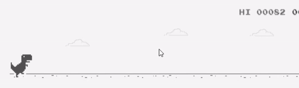

# deepDino
This project automates the chrome dino game using CNN. The deepDino model takes image as an input and classifies it as either "Right" , "Down" or "Up" as an output. According to this the dino makes the decision to jump.

# Loss Graph

# Automated Chrome Dino game

